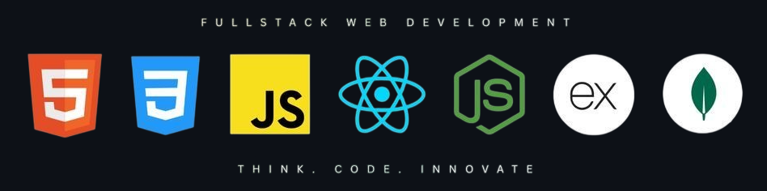

<h1 align="center">Hi 👋, I'm Yatish Kumar Singh</h1>
<h3 align="center">A passionate full stack developer from India</h3>

  

  

- 🌱 I’m currently learning *Backend*

- 💬 Ask me about *JavaScript, Git*

- 📫 How to reach me *yatishsingh48@gmail.com*

<h3 align="left">Connect with me:</h3>

<h3 align="left">Languages and Tools:</h3>

  &nbsp;&nbsp;
  &nbsp;&nbsp;
  &nbsp;&nbsp;
  &nbsp;&nbsp;
  &nbsp;&nbsp;
  &nbsp;&nbsp;
  &nbsp;&nbsp;
  &nbsp;&nbsp;
  &nbsp;&nbsp;
  &nbsp;&nbsp;
  &nbsp;&nbsp;
  &nbsp;&nbsp;
  &nbsp;&nbsp;
  &nbsp;&nbsp;
  

# 📊 GitHub Stats:
 
 

### 🔝 Top Contributed Repo

---

